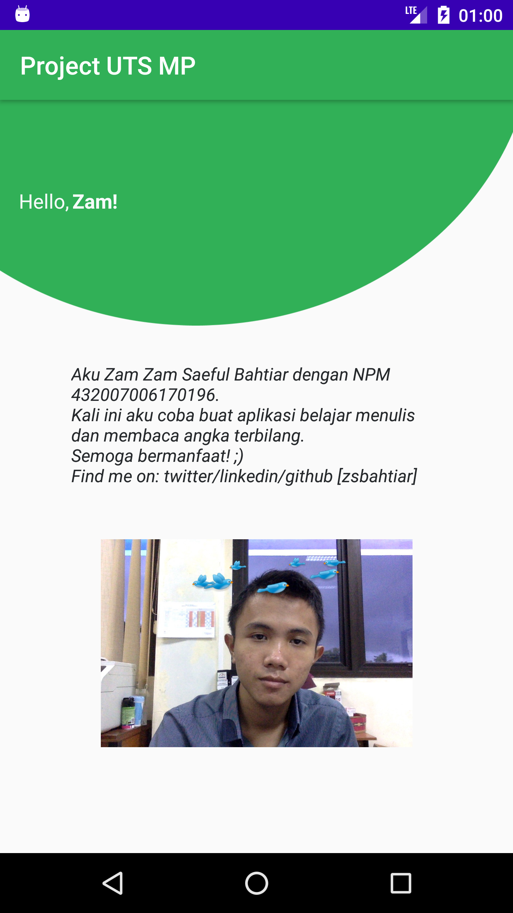

# Belajar Membaca dan Menulis Angka Terbilang

Aplikasi ini dibuat untuk memenuhi tugas Ujian Tengah Semester Mata Kuliah Mobile Programming

- [Video](https://www.youtube.com/watch?v=rtSXl2PHL0o&feature=youtu.be)
- [Slide](https://docs.google.com/presentation/d/1WTNCGRnZ743coKSIOwX3IsKBnIDg4w6gwWH0wzZ2NyA/edit?usp=sharing)

## Image

